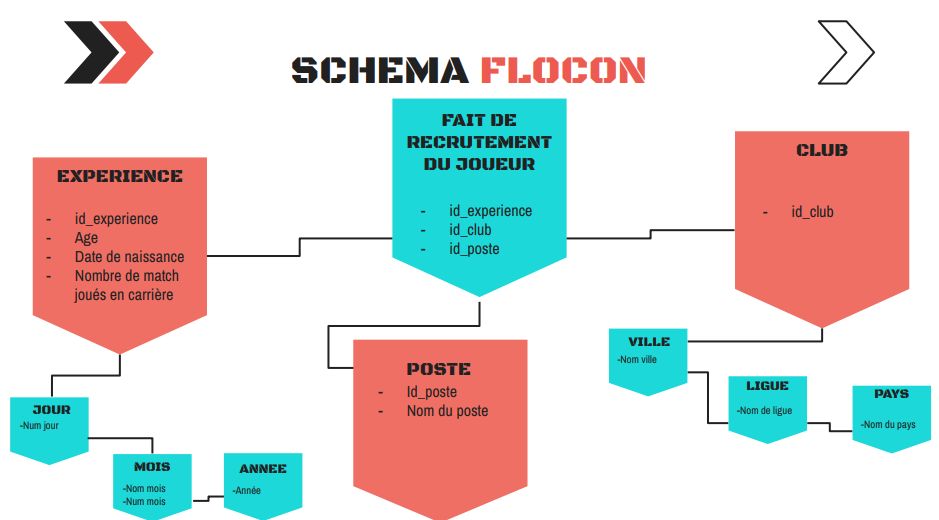
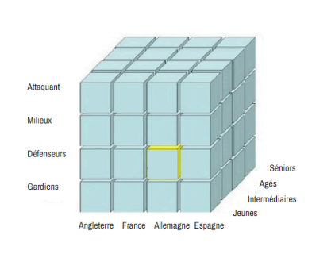
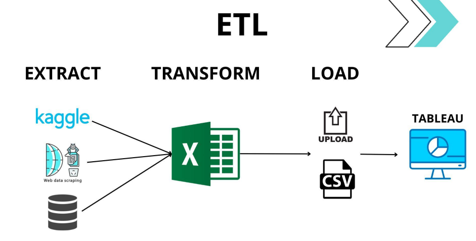
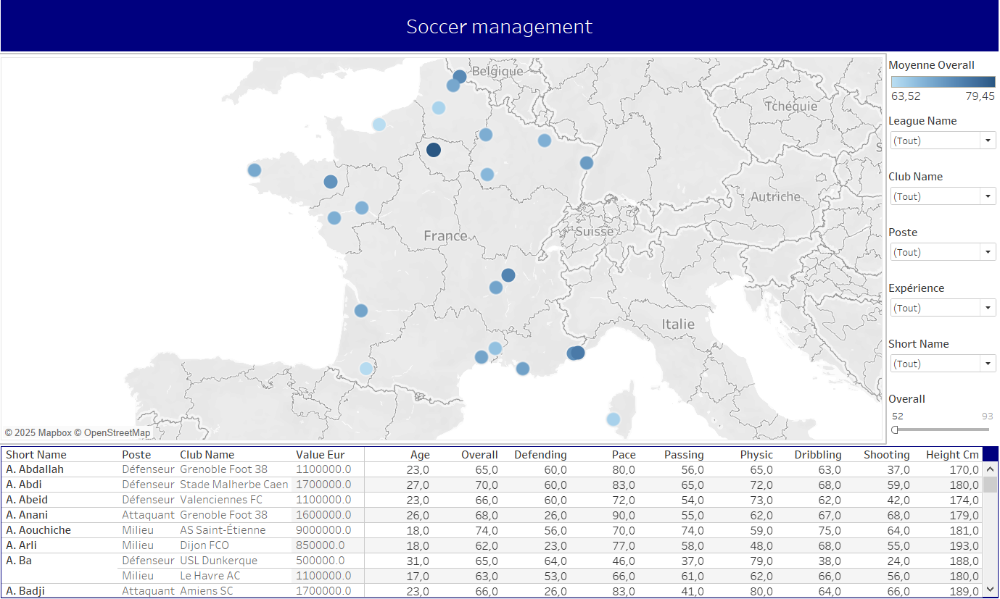
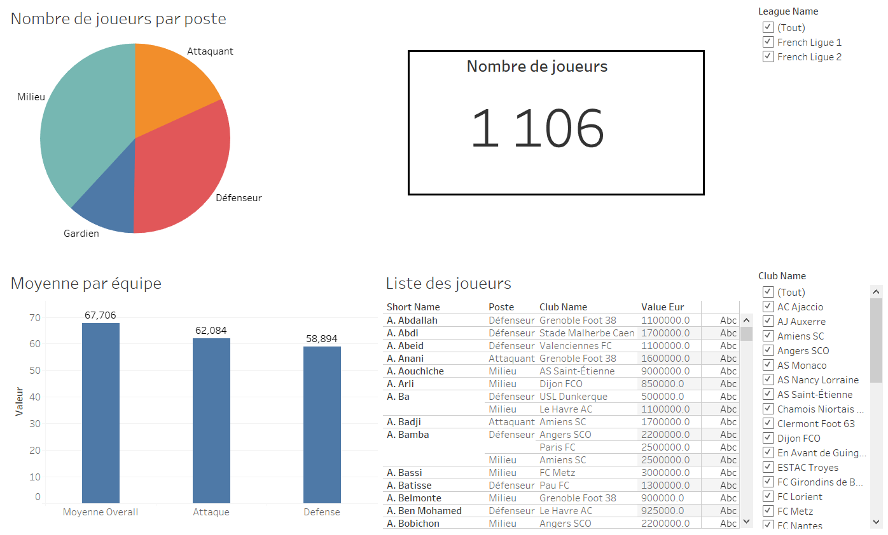

# Projet Business Intelligence : Recrutement de joueurs de football

## Contexte

Le football est un domaine vaste et complexe qui englobe divers aspects, dont l'analyse de matchs, la gestion d'équipe et le recrutement des joueurs. Passionnés de football et curieux de combiner notre expertise en Business Intelligence avec notre passion, nous avons choisi de concentrer notre projet sur un aspect clé du football : le recrutement des joueurs. 

Le challenge consistait à développer un outil d'aide à la décision pour faciliter le recrutement de joueurs en utilisant des données extraites du jeu vidéo FIFA. 
Après une recherche approfondie, nous avons opté pour l'utilisation des données disponibles sur Kaggle, qui offrent une description détaillée des performances des joueurs.

## Objectif

L'objectif de ce projet est de créer un outil d'aide à la décision pour le recrutement de joueurs de football en analysant les performances des joueurs basées sur les données extraites du jeu vidéo FIFA. Ce projet vise à fournir une visualisation dynamique et interactive des joueurs de Ligue 1, permettant aux recruteurs de mieux évaluer les joueurs et de prendre des décisions éclairées pour renforcer les équipes.

## Les étapes

1. **Modélisation des données (modèle en flocon et cube OLAP)**
   - Identification des dimensions clés : expérience, région et poste du joueur.
   - Construction d'un modèle en flocon avec une granularité fine pour une analyse approfondie.
  
     
  
   - Création du cube OLAP et analyse multidimensionelle
  
     

3. **Traitement des données**
   - Traitement des données manquantes et ajout de données externes (budget des clubs de Ligue 1).
   - Enrichissement du dataset avec des informations supplémentaires pour mieux comprendre les contextes des joueurs.
  
     

3. **Visualisation des données**
   - Création d'un dashboard interactif avec des filtres permettant d'explorer les performances des joueurs en fonction de critères comme le prix, la vitesse, la défense, etc.
   - Intégration d'une carte interactive pour visualiser la répartition géographique des clubs.

   
   

## Résultat

L'outil facilite le processus de recrutement en offrant des fonctionnalités de filtrage et de tri sur des variables telles que le prix, la note générale, la vitesse, la défense, et bien d'autres. Il inclut également une carte interactive des clubs de Ligue 1, permettant une analyse géographique des données. 
Ce tableau de bord permet aux recruteurs d'identifier plus facilement les talents émergents et de prendre des décisions éclairées pour renforcer les équipes de football.
